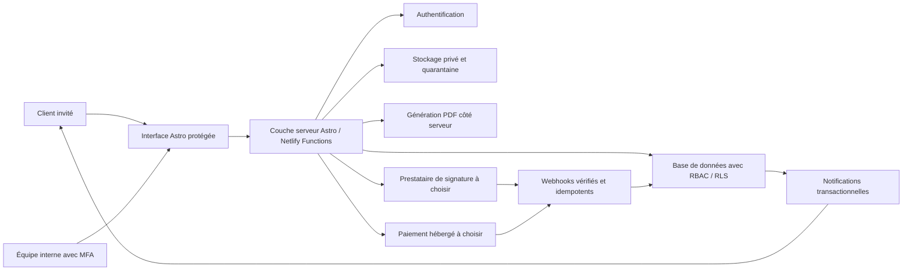

# Architecture sûre d'un futur espace client

Ce document décrit une architecture cible pour un espace client relié au site Astro/Netlify. Il ne sélectionne, ne configure et n'active aucun fournisseur. Aucun portail ne doit être publié avant validation des choix, contrats, accès et règles de conservation par le propriétaire.

## 1. Résultat attendu

L'espace client doit permettre à un client invité de :

- consulter l'état de sa demande et de son déménagement ;
- vérifier l'inventaire et les informations opérationnelles ;
- consulter les versions de son devis ;
- accepter et signer la version définitive ;
- payer un acompte via une page de paiement hébergée ;
- consulter ses documents ;
- envoyer un message lié au dossier ;
- recevoir des notifications sans contenu sensible dans l'email ou le SMS.

Le formulaire public reste sans compte. Un compte client n'est proposé qu'après qualification de la demande, afin de ne pas ajouter de friction à l'acquisition.

## 2. Principes non négociables

1. Pas de portail « frontend only » utilisant une clé privilégiée dans le navigateur.
2. Pas de bucket public pour les photos, devis ou pièces jointes.
3. Le navigateur ne décide jamais d'un montant, d'un statut de paiement ou de la version signée.
4. Chaque accès à un dossier est contrôlé côté serveur et, si la base le permet, également par des règles de sécurité au niveau des lignes.
5. Les liens vers les fichiers sont signés, courts et révocables.
6. Les événements de paiement et de signature ne sont validés qu'après vérification cryptographique du webhook du fournisseur.
7. Les devis acceptés sont immuables : toute modification crée une nouvelle version.
8. Les logs techniques ne contiennent ni adresse, téléphone, email, message, URL signée ou contenu de document.
9. Les sauvegardes et restaurations sont testées avant la mise en production.
10. Aucun fournisseur, clé API ou destinataire n'est supposé dans le dépôt.

## 3. Architecture cible



Deux implantations sont possibles :

- **même dépôt, rendu hybride/SSR :** pages publiques statiques et espace client rendu côté serveur avec fonctions Netlify ;
- **application séparée sur un sous-domaine :** par exemple un portail isolé du site marketing, avec déploiement, cookies, CSP et permissions séparés.

Le sous-domaine offre une meilleure séparation de sécurité et de cache. Le même dépôt réduit le coût opérationnel. Ce choix doit être fait avant de modifier la configuration Astro ou Netlify.

## 4. Authentification

### Parcours client recommandé

1. Un collaborateur qualifie le lead.
2. Le serveur crée une invitation liée au dossier, jamais un mot de passe envoyé par email.
3. Le client reçoit un magic link à usage unique ou un code à durée courte.
4. À l'ouverture, le serveur vérifie l'invitation, l'identité et l'appartenance au dossier.
5. Une session sécurisée est créée avec expiration et possibilité de révocation.

Contrôles requis :

- magic link à usage unique, durée indicative courte à décider ;
- limitation des tentatives et protection contre l'énumération des comptes ;
- cookies `Secure`, `HttpOnly` et `SameSite` adaptés ;
- rotation et révocation des sessions ;
- MFA obligatoire pour le personnel ;
- journalisation des connexions, invitations, révocations et changements de rôle ;
- aucun secret d'authentification dans `localStorage` ;
- confirmation supplémentaire avant signature, changement d'email ou action financière sensible.

Un magic link transféré peut donner accès au dossier. Il faut donc décider si un code secondaire, une date de naissance, un numéro de devis partiel ou une autre vérification est nécessaire. Ne pas utiliser d'information facilement devinable sans évaluation du risque.

## 5. Modèle de données minimal

| Entité | Rôle | Règle importante |
|---|---|---|
| `users` | Identité authentifiée | Aucun rôle administratif par défaut |
| `customers` | Profil client | Séparé des identifiants d'authentification |
| `leads` | Demande initiale | Conserve source et attribution sans écraser l'origine |
| `moves` | Dossier opérationnel | Un client ne voit que ses dossiers autorisés |
| `move_access` | Relation utilisateur/dossier | Source de vérité des permissions client |
| `quotes` | Devis logique | Statut global et version active |
| `quote_versions` | Version PDF et montants | Immuable après envoi ou acceptation selon la règle choisie |
| `signatures` | Demande et preuve de signature | Référence fournisseur et hash, jamais une signature simulée |
| `payments` | Acompte, solde, remboursement | Statut confirmé par webhook serveur |
| `documents` | Métadonnées de fichiers | Bucket privé, hash, type, taille, propriétaire |
| `messages` | Conversation liée au dossier | Texte nettoyé, auteur et horodatage |
| `status_history` | Historique métier | Transition, acteur, ancien et nouveau statut |
| `webhook_events` | Réception des webhooks | Identifiant fournisseur unique et résultat du traitement |
| `audit_log` | Actions sensibles | Append-only, sans contenu PII inutile |

Chaque table doit comporter des identifiants non séquentiels exposables, des dates serveur et une politique explicite de suppression ou d'archivage.

## 6. Rôles et permissions

| Rôle | Capacités principales | Interdictions |
|---|---|---|
| Client | Lire ses dossiers, documents autorisés et messages ; accepter son devis | Voir un autre client, changer un prix ou un statut financier |
| Commercial | Qualifier, préparer et envoyer un devis | Confirmer manuellement un paiement reçu par webhook |
| Opérations | Planning, accès, inventaire opérationnel, statut du déménagement | Modifier les prix ou les droits administratifs |
| Comptabilité | Lire devis/paiements, initier une action autorisée de remboursement | Lire les messages et photos sans besoin métier |
| Administrateur | Gérer rôles, configuration et incidents | Utilisation quotidienne d'un compte super-admin partagé |
| Service système | Webhooks et tâches serveur limitées | Session interactive dans le navigateur |

Les contrôles doivent exister dans la couche serveur et dans la base quand elle prend en charge RLS. Une clé `service role` ou équivalente ne doit jamais être transmise au client Astro.

## 7. Documents et fichiers

Organisation recommandée :

- bucket d'arrivée en quarantaine ;
- validation de taille, extension, MIME réel et signature du fichier ;
- analyse antivirus avant promotion dans le bucket privé ;
- chemins générés côté serveur, sans nom de client ;
- URL signée d'une durée courte pour la consultation ;
- téléchargement autorisé après contrôle du dossier et du rôle ;
- hash du contenu et métadonnées d'audit ;
- suppression indépendante des miniatures et dérivés ;
- blocage des exécutables, archives et formats non nécessaires.

Les notifications doivent dire « un nouveau document est disponible » et renvoyer vers le portail. Elles ne doivent pas joindre automatiquement le devis, les photos ou l'inventaire.

## 8. Devis PDF et signature

Le devis est construit côté serveur depuis une version figée des données : identité légale, client, adresses, inventaire, prestations, exclusions, dates, prix, taxes et conditions.

Pour chaque version :

- numéro et version uniques ;
- date de génération serveur ;
- JSON source immuable ou snapshot équivalent ;
- PDF stocké en privé ;
- hash SHA-256 du PDF ;
- auteur et motif de modification ;
- lien entre acceptation, version et preuve de signature.

La signature doit être confiée à un fournisseur choisi après validation juridique et contractuelle. Le serveur crée la demande, reçoit le webhook signé, récupère le dossier de preuve et marque la version exacte comme acceptée. Une case à cocher locale ou une image de signature ne doit pas être présentée comme équivalente à une signature électronique conforme.

Après acceptation, une correction crée une nouvelle version et, selon sa nature, une nouvelle demande de signature. Le PDF accepté ne doit jamais être réécrit.

## 9. Acompte et paiement

Le paiement doit utiliser une page hébergée par le prestataire afin que le site ne reçoive aucune donnée de carte.

Flux :

1. Le serveur lit la version du devis autorisée.
2. Il calcule l'acompte selon une règle enregistrée côté serveur.
3. Il crée une session de paiement idempotente avec devise, montant et référence du dossier.
4. Le client est redirigé vers la page du prestataire.
5. Le retour navigateur affiche seulement « vérification en cours ».
6. Seul le webhook signé confirme `payment.succeeded`, `failed` ou `refunded`.
7. Le rapprochement vérifie montant, devise, devis et identifiant client.

Le montant envoyé par le navigateur ne doit jamais être accepté comme source de vérité. Les remboursements exigent un rôle dédié, un motif et une trace d'audit.

## 10. Statuts, documents et messages

Statuts indicatifs à valider :

`nouveau` → `a-qualifier` → `visite-planifiee` → `devis-en-preparation` → `devis-envoye` → `accepte` → `acompte-recu` → `planifie` → `en-cours` → `termine`.

Les branches `refuse`, `expire`, `annule` et `litige` doivent avoir des transitions explicites. L'interface ne doit pas permettre de passer arbitrairement d'un statut à un autre.

Les messages sont toujours liés à un dossier. Ils supportent : auteur, visibilité client/interne, horodatage, état de lecture et pièces jointes autorisées. Les notes internes ne doivent jamais être sérialisées dans une réponse client, même si elles sont masquées par CSS.

## 11. Webhooks et modèle événementiel

Événements métier suggérés :

```text
lead.created
lead.qualified
portal.invitation.created
portal.invitation.accepted
visit.scheduled
quote.version.created
quote.sent
quote.viewed
quote.accepted
quote.declined
signature.completed
signature.failed
deposit.requested
payment.succeeded
payment.failed
payment.refunded
move.scheduled
move.status.changed
document.uploaded
document.approved
message.created
```

Chaque événement comporte : `event_id`, `event_type`, `occurred_at`, `aggregate_type`, `aggregate_id`, `actor_type`, `actor_id`, version du schéma et payload minimal.

Pour les webhooks entrants :

- conserver le corps brut nécessaire à la vérification de signature uniquement selon la durée décidée ;
- vérifier signature, timestamp et tolérance anti-rejeu ;
- imposer une contrainte unique sur l'identifiant fournisseur ;
- répondre rapidement puis traiter de manière asynchrone ;
- rendre chaque handler idempotent ;
- journaliser succès, nombre de tentatives et erreur technique nettoyée ;
- prévoir retries avec backoff et file d'échec inspectable ;
- ne jamais modifier directement plusieurs statuts sans transaction.

Pour les webhooks sortants vers un CRM : signature HMAC, allowlist de destination, timeout court, retries limités et aucun fichier binaire dans le payload.

## 12. Conservation, audit et exploitation

Le propriétaire doit valider une matrice de conservation avant lancement :

| Catégorie | Décision requise |
|---|---|
| Leads sans suite | Durée avant suppression ou anonymisation |
| Photos d'évaluation | Suppression après devis refusé, expiré ou dossier terminé |
| Devis acceptés et factures | Durée découlant des obligations légales confirmées |
| Messages | Durée opérationnelle et règles en cas de litige |
| Preuves de signature | Durée contractuelle validée avec conseil compétent |
| Logs de sécurité | Durée permettant l'investigation sans conservation excessive |
| Webhook payloads | Contenu minimal et durée technique courte |
| Backups | Nombre de versions, chiffrement et délai de purge |

Le journal d'audit enregistre les actions sensibles, pas le contenu complet : connexion, invitation, lecture/téléchargement de document sensible, changement de rôle, génération/envoi/acceptation de devis, paiement, remboursement, export et suppression.

Un test de restauration, une revue trimestrielle des rôles et une procédure de révocation immédiate sont nécessaires.

## 13. Migration depuis Netlify Forms

### Phase A — préparation

1. Figer le dictionnaire des 65 champs du formulaire `devis-intelligent`.
2. Définir le mapping vers `leads`, `moves`, `documents` et les tables de référence.
3. Exporter un petit échantillon de test, sans l'ajouter au dépôt.
4. Importer dans un environnement non productif et comparer comptages, dates, statuts et estimations.
5. Définir une clé d'import unique issue de l'identifiant Netlify, stockée de façon non exposée.

### Phase B — fichiers

1. Identifier les soumissions dont les photos sont encore nécessaires selon la politique validée.
2. Télécharger côté serveur, jamais depuis le navigateur administrateur.
3. Vérifier taille, MIME, hash et antivirus.
4. Charger en quarantaine puis promouvoir en stockage privé.
5. Relier le document au dossier et enregistrer la provenance.
6. Supprimer l'ancienne copie lorsque la migration et la politique le permettent.

### Phase C — bascule

1. Conserver Netlify Forms comme source primaire pendant une période courte de vérification.
2. Ajouter un traitement serveur `submission-created` idempotent vers la nouvelle base.
3. Comparer quotidiennement les volumes et échecs, sans exporter de PII dans les logs.
4. Basculer les opérations internes vers le nouveau système.
5. Maintenir un rollback documenté tant que les comptages ne sont pas réconciliés.
6. Désactiver l'ancien traitement seulement après export final, contrôle et validation du propriétaire.

Ne pas fusionner automatiquement deux personnes sur le seul numéro de téléphone ou email. Les doublons potentiels doivent être proposés à un collaborateur avec comparaison minimale et trace d'audit.

## 14. Supabase ou CRM/portail géré

| Critère | Supabase ou backend composable | CRM/portail métier géré |
|---|---|---|
| Contrôle UX et données | Élevé | Dépend du produit |
| Délai initial | Plus long | Souvent plus court |
| Auth, RLS et stockage | À configurer et tester | Inclus, qualité à auditer |
| Devis/signature/paiement | Intégrations séparées | Parfois incluses |
| Adaptation au métier local | Forte | Limitée au modèle du fournisseur |
| Maintenance technique | À la charge du projet | Principalement fournisseur |
| Export et réversibilité | Schéma contrôlé | API/export à vérifier avant contrat |
| Coût | Infrastructure + développement | Abonnement, utilisateurs et options |
| RGPD/localisation | Choix de région et configuration à valider | DPA, sous-traitants et hébergement à auditer |
| Risque principal | Mauvaise configuration des politiques d'accès | Verrouillage fournisseur et personnalisation limitée |

Supabase est adapté si l'objectif est une expérience différenciante, un schéma maîtrisé et une évolution progressive. Un CRM/portail géré est adapté si les fonctions devis, planning, signature et paiement existent réellement, si l'API est suffisante et si la réversibilité est contractuelle.

Avant de choisir un CRM, exiger une démonstration avec le flux réel, un export complet, la documentation API/webhooks, le DPA, la liste des sous-traitants, les options de suppression et un devis incluant utilisateurs, stockage, signature et paiements.

## 15. Décisions et accès requis du propriétaire

### Décisions métier

- portail dans le même domaine ou sur un sous-domaine ;
- rôles internes, personnes affectées et responsable des habilitations ;
- statuts autorisés et transitions ;
- moment où le client reçoit son invitation ;
- durée du magic link, durée de session et vérification secondaire ;
- contenu exact des formules et du devis ;
- règle d'acompte, échéance, annulation et remboursement ;
- documents visibles par le client ;
- notifications souhaitées : email, SMS ou WhatsApp avec consentement adapté ;
- matrice de conservation et procédure de suppression ;
- besoin de support multilingue ;
- responsable des incidents et délai de traitement attendu.

### Choix fournisseurs

- base/auth/storage : projet Supabase ou autre backend, ou CRM/portail géré ;
- email transactionnel et domaine d'envoi ;
- signature électronique et niveau de preuve attendu ;
- paiement, devise, moyens acceptés et compte de versement ;
- éventuel SMS/WhatsApp ;
- antivirus ou service d'analyse des fichiers ;
- monitoring et alertes ;
- outil de sauvegarde/export si non inclus.

### Credentials à fournir uniquement via gestionnaire sécurisé

Selon les choix retenus :

```text
DATABASE_URL
AUTH_PROJECT_URL
AUTH_PUBLIC_KEY
AUTH_SERVER_SECRET
STORAGE_PRIVATE_BUCKET
TRANSACTIONAL_EMAIL_API_KEY
TRANSACTIONAL_EMAIL_FROM
SIGNATURE_API_KEY
SIGNATURE_WEBHOOK_SECRET
PAYMENT_PUBLIC_KEY
PAYMENT_SECRET_KEY
PAYMENT_WEBHOOK_SECRET
NOTIFICATION_API_KEY
NOTIFICATION_WEBHOOK_SECRET
```

Les noms réels dépendront des fournisseurs. Les secrets doivent être ajoutés dans les variables d'environnement chiffrées de Netlify ou du backend, jamais dans `.env` partagé, Git, un document, une capture ou un message.

Il faut également : accès administrateur au site Netlify, domaine/DNS, compte email d'envoi, comptes sandbox de paiement et signature, URLs de webhook autorisées et contacts de facturation. Commencer en sandbox avec des données synthétiques.

## 16. Ordre de réalisation recommandé

1. Valider les décisions métier, RBAC et conservation.
2. Comparer deux solutions maximum avec un scénario réel.
3. Choisir l'architecture et signer les accords nécessaires.
4. Construire auth, modèle de données et audit avant l'interface riche.
5. Ajouter documents privés et devis versionné.
6. Intégrer signature en sandbox.
7. Intégrer paiement en sandbox.
8. Migrer un échantillon Netlify Forms.
9. Réaliser tests d'autorisation croisés, sécurité, restauration et webhooks rejoués.
10. Piloter avec quelques dossiers internes avant ouverture générale.

## 17. Critères de mise en production

- aucun secret privilégié dans le bundle navigateur ;
- test prouvant qu'un client A ne peut lire aucun objet du client B ;
- MFA du personnel activée ;
- politiques RLS/RBAC testées automatiquement ;
- fichiers privés, URLs courtes et quarantaine opérationnelle ;
- webhooks signés, idempotents et rejouables ;
- montants calculés côté serveur ;
- devis accepté immuable avec hash et preuve ;
- sauvegarde et restauration testées ;
- politique de confidentialité et sous-traitants mis à jour ;
- procédure d'incident, révocation et suppression documentée ;
- migration réconciliée avec rollback ;
- validation explicite du propriétaire avant activation des fournisseurs et du portail.
